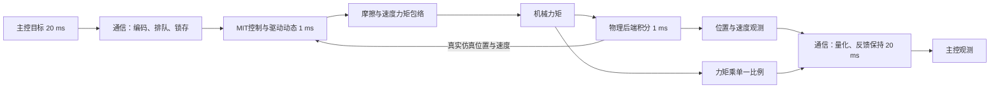

# GF43X40-10 最终默认执行器模型整理

核对日期：2026-09-21。本文中的“最终版”指工作区当前默认生效版本。

**版本：`shared_fixed_gain_kd_band_v8_torque_proxy`。模型由等效机械动力学、速度/力矩观测及通信时序三部分组成；所有电机共用一组标定参数，各关节可采用不同 Kp/Kd。**

源参数 SHA-256：`25c27cf4b1a4bc391a03d5e18958255970efc594fe4a15622d533b20b8135c9e`，与 UniLab 校准包记录一致。

| 参数类别 | 数量 | 口径 |
|---|---:|---|
| 机械、驱动、摩擦 | 27 | 包含显式指令延迟；部分参数仅用于裸轴摩擦分支 |
| 速度反馈 | 4 | 滤波时间常数、比例、偏置及 Kp 对滤波的修正 |
| 粗略力矩反馈 | 1 | 机械力矩到反馈读数的比例 |
| 合计 | **32** | 不含协议范围、其余通信设置、硬件参考、选择字符串及派生量 |

21项机械模型（加观测共26项）是未晋升候选，不是当前默认。历史48项、42项说明及7系数负载反馈均不代表当前运行路径。

## 信号流与周期



机械状态和通信反馈是两条不同的通路。反馈速度不能覆写物理后端速度；粗略力矩反馈也不反向施加给机械系统。

## 机械计算

输入是关节位置 q、速度 v，以及 MIT 五项指令 `q_des, qd_des, kp, kd, tau_ff`。下列公式描述 UniLab 当前实现，步长 Δt=0.001 s。

1. **内部速度与控制请求。** 内部速度采用一阶低通，时间常数为0.271813 ms。令 g=Kp/(Kp+80)，则：

   ```text
   u_req = clip(
       Kp·exp(kp_gain_slope·g)·(q_des-q)
       + Kd·exp((kd_gain_slope+0.04·B)·g)·(qd_des+velocity_target_bias-v_internal)
       + feedforward_gain·tau_ff,
       -28, 28)
   ```

   B 是平滑增益窗口。Kp在70–80上升、110–130下降；Kd在2.6–2.9上升、3.2–3.5下降，中间平台为1。它在Kp约80–110、Kd约3附近增强内部速度阻尼，不改变外部指令值。

2. **驱动响应。** `effort` 以一阶响应跟随 u_req，同时每步变化不超过 `990.569129×0.001`。常规时间常数6.753991 ms，释放/反向时乘0.928525；制动时随速度在0.5–2 rad/s之间平滑过渡到约1 ms。

3. **机械作用与摩擦。** 先计算 `torque_scale×effort − viscous×coast_state×v`，再处理方向摩擦。零Kp、零Kd且前馈绝对值≤0.007时，滑行阻力目标倍率为0.35，否则为1。方向记忆随转动距离更新。

4. **能力包络。** 使用参考速度—力矩数据构造分段线性包络，乘统一机械尺度。同转速重复点取较小力矩，排除标记为可疑的首行；低于参考速度区间使用低速上限，高于最高参考速度时驱动上限为0。制动采用独立上限；最后施加机械总限幅。

5. **后端积分。** armature作为关节附加等效惯量设置到后端；原joint damping和frictionloss清零，避免与组件摩擦重复计入。

| 核心参数 | 当前值 | 含义 |
|---|---:|---|
| `armature` | 0.25429975910988406 | 等效附加惯量 |
| `torque_scale` | 5.307062074754017 | 名义驱动到仿真机械作用的尺度 |
| `feedforward_gain` | 0.2445125963333848 | 前馈作用增益 |
| `coulomb` / `coulomb_negative` | 0.2789574700 / 0.2665784641 | 正反向库仑摩擦 |
| `viscous` | 0.22184734374066803 | 黏性摩擦 |
| `friction_velocity` | 0.03280873402539427 rad/s | 低速摩擦过渡尺度 |
| `static_ratio` / `static_ratio_negative` | 1.9768494887 / 1.9734173031 | 裸轴正反向静摩擦倍率 |
| `low_speed_drive_limit` | 47.232852465310756 | 等效低速驱动与制动上限 |
| `mechanical_torque_limit` | 148.5977380931125 | 派生的仿真总截断值 |

派生关系：`envelope_scale=torque_scale`；`braking_limit=low_speed_drive_limit`；`mechanical_torque_limit=torque_scale×28`。这些不是额外独立拟合参数。最终实际输出还受速度包络限制，148.5977不是通常可输出的力矩，更不是实测硬件峰值。

## 裸轴与整机的摩擦差异

| 模式 | 用途 | 实际处理 |
|---|---|---|
| `isolated_1d` | 独立执行器默认；裸轴标定 | 使用该轴含armature的实际广义质量；带方向记忆、Stribeck及黏着判断 |
| `smooth_coupled_approx` | `GF43X40RobotMotor`明确选择 | 使用方向记忆及平滑库仑摩擦 `Fc×tanh(v/friction_velocity)`；不执行裸轴静止黏着求解 |
| `smooth_stribeck` | 显式加载21项候选 | 统一连续Stribeck近似；当前默认不启用 |

裸轴的两个静摩擦倍率和静止速度阈值不参与当前整机近似分支。因此“27项机械配置”不等于整机每一步都使用27个独立系数。将耦合机器人的质量矩阵对角项传给裸轴算法，不能据此声称物理等价。

## 反馈模型

位置读取物理后端位置，再交给通信层量化。

速度反馈有独立状态，其时间常数随Kp变化：

```text
T_velocity = 0.0025412807208095266 × exp(3.4681956441056276 × (g-0.65))
v_filtered += (1-exp(-Δt/T_velocity)) × (v_after-v_filtered)
v_feedback = 0.9987451905437824 × v_filtered - 0.0012717069082022608
```

比例在执行器中施加，偏置及floor编码在通信层施加。

**力矩反馈只有一个乘法：**

```text
tau_feedback = 0.1198991043896492 × last_torque
```

last_torque是本物理子步经过摩擦与包络限制后的机械力矩。当前力矩通道没有独立低通、加速度项、负载修正、保持偏置或54系数残差层。协议限幅和量化仍执行。该读数用于粗略诊断，未作真实轴端力矩绝对标定。

## 通信与整机接口

| 项目 | 设置 |
|---|---|
| 电机/物理周期 | 1 ms，1 kHz |
| 主控指令/反馈标称周期 | 20 ms，50 Hz |
| 位置协议 | ±12.5 rad，16位 |
| 速度协议 | ±10 rad/s，12位 |
| 名义力矩协议 | ±28，12位 |
| 增益协议 | Kp=0–500；Kd=0–5；均12位 |
| 校准显式固定延迟 | 命令0、反馈0；含义为不额外叠加未辨识固定延迟 |
| XDuck训练通信模式 | `measured_20260918` |

实测模式近似稀疏晚到：命令99.5224%无额外晚到，其余1–5 ms；反馈99.9384%无额外晚到，其余1 ms。组件独立构造时仍默认零范围的uniform模式，须显式选择实测模式。

等待新指令时保持旧目标，等待新反馈时保持旧反馈；电机仍每1 ms更新，不冻结力矩。旧帧不能覆盖新帧。目前一次批量帧共享一次延迟抽样，并非每个环境独立采样。

通用执行器支持完整MIT五项输入。当前整机适配器每20 ms提交位置目标，速度目标与前馈为0；每1 ms调用`compute_torque`，后端积分后调用`observe`和通信`sample`。Kp/Kd属于任务控制配置，不能混作共性模型标定参数。

## 已有验证和适用边界

以下为仓库已有报告结果，本次整理未重新运行实验：

- 力矩反馈简化前后，152条裸轴/带载记录的机械运动相关输出逐元素相等。
- 305组冻结回放、795,599采样点中，位置、速度、指令力矩、机械力矩、加速度、包络区域和饱和标记最大变化为0；允许力矩反馈变化。
- 已有Python/C回放、UniLab两种摩擦模式、批量与部分重置、通信编码等软件检查。
- 粗略反馈有明确精度代价：裸轴留出CAN力矩RMSE从0.1280升为0.3073，带载独立check_01从0.2513升为0.4899（逐记录RMSE平均，名义Nm）。这不表示位置/速度模型退化。
- 21项机械候选未替换默认：裸轴留出位置RMSE从0.003501变为0.004725 rad，28次阶跃停稳误差P95从7.064变为20.400 ms。
- 现有悬吊数据及软件一致性不构成落地策略、真实轴端力矩、电气热效应或持续过载能力验收。

## 文件入口

| 文件 | 作用 |
|---|---|
| [parameters_refined.json](parameters_refined.json) | 当前标定源参数 |
| [actuator.py](actuator.py) | 独立裸轴模型实现 |
| [UniLab calibration.json](../../unilab/src/unilab/actuators/gf43x40/calibration.json) | 当前运行校准包，含派生量、协议范围与来源哈希 |
| [UniLab actuator.py](../../unilab/src/unilab/actuators/gf43x40/actuator.py) | 批量执行器与观测计算 |
| [communication.py](../../unilab/src/unilab/actuators/gf43x40/communication.py) | 指令/反馈编码、队列、时序、抖动 |
| [robot.py](../../unilab/src/unilab/actuators/gf43x40/robot.py) | 整机50 Hz/1 kHz调用适配 |
| [完整中文参数表](../../data/gf43x40_10_alignment/experiments/v8_torque_proxy_20260918/PARAMETERS_CN.md) | 全32项名称、数值和解释 |
| [最终版验证报告](../../data/gf43x40_10_alignment/experiments/v8_torque_proxy_20260918/RESULTS.md) | 反馈简化及运动保持验证 |
| [21项候选报告](../../data/gf43x40_10_alignment/experiments/v8_unified21_20260918/RESULTS.md) | 候选效果与未晋升原因 |

现有组件README保留多轮“当前默认”的历史说明。判断最终版本时，以标定源、运行校准包和当前代码分支为准。
